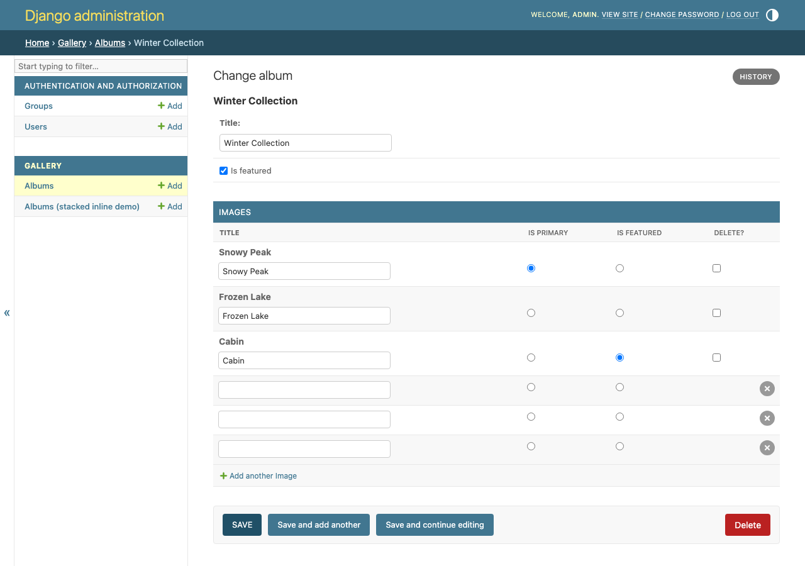
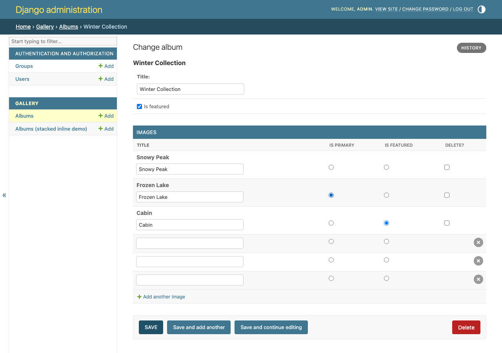
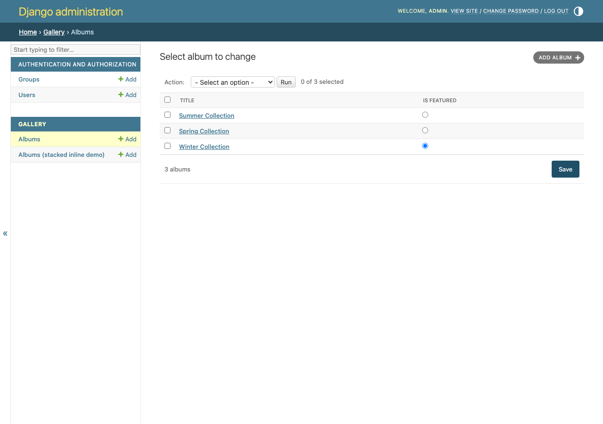

# django-admin-radio-select

Synchronize BooleanFields across Django Admin inline rows as mutually exclusive radio button groups.

## Problem

An inline `BooleanField` column renders as independent checkboxes:

```text
Image A    [ ]
Image B    [x]
Image C    [ ]
```

Nothing stops you from checking more than one — but often only one row should ever be true (the primary image, the default address, the featured item). This package renders that column as radio buttons instead:

```text
Image A    ( )
Image B    (•)
Image C    ( )
```

Selecting one clears the others, enforced with a small vanilla JS module. Every row still POSTs under its own normal Django-generated field name (e.g. `images-0-is_primary`, `images-1-is_primary`) — nothing here relies on giving different forms the same HTML `name`. A formset-level check on the server also rejects a handcrafted POST that tries to set more than one row true, so the guarantee doesn't depend on JavaScript running at all.

Inline formset, before and after clicking a different row's radio — note `is_primary` switches from "Snowy Peak" to "Frozen Lake" while the independent `is_featured` column ("Cabin") is untouched:




Same behavior on a `ModelAdmin` changelist, via `list_editable` (see below):



## Install

```bash
uv add django-admin-radio-select
# or
pip install django-admin-radio-select
```

Add the app so its static JS gets collected:

```python
INSTALLED_APPS = [
    ...,
    "django_admin_radio_select",
]
```

## Usage

```python
from django.contrib import admin
from django_admin_radio_select import RadioSelectMixin

from .models import Album, Image


class ImageInline(RadioSelectMixin, admin.TabularInline):
    model = Image
    radio_select_exclusive_fields = ("is_primary",)


@admin.register(Album)
class AlbumAdmin(admin.ModelAdmin):
    inlines = [ImageInline]
```

Works the same way with `StackedInline`:

```python
class ImageInline(RadioSelectMixin, admin.StackedInline):
    model = Image
    radio_select_exclusive_fields = ("is_primary",)
```

Multiple fields are independent groups:

```python
class ImageInline(RadioSelectMixin, admin.TabularInline):
    model = Image
    radio_select_exclusive_fields = ("is_primary", "is_featured")
```

Compute the field list per request (and, for an inline or a change form, per object) instead of (or in addition to) the class attribute:

```python
class ImageInline(RadioSelectMixin, admin.TabularInline):
    model = Image

    def get_radio_select_exclusive_fields(self, request, obj=None):
        return ("is_primary",) if request.user.is_superuser else ()
```

The default implementation already drops any field that's currently in `get_readonly_fields(request, obj)` — a readonly field isn't rendered as an editable widget at all, so there's nothing to turn into a radio button. This matters for a field that's only conditionally readonly (permissions, object state, ...): without it, a field in `radio_select_exclusive_fields` that becomes readonly for some request would no longer be on the form at all and raise `ImproperlyConfigured`, for a state the admin class itself put it in. Overriding `get_radio_select_exclusive_fields` replaces this default entirely, so an override that needs the same behavior should apply its own `get_readonly_fields` check too.

Each configured name must be a `BooleanField` present on the form; anything else raises `ImproperlyConfigured` when the admin builds the formset (a `python manage.py check`-time-ish failure, not a silent no-op).

### `ModelAdmin` changelist (`list_editable`)

The same mixin also works directly on a `ModelAdmin`, for a `BooleanField` column made editable in the changelist via `list_editable`. The field still has to be in `list_display` too — that's a normal Django `list_editable` requirement, unrelated to this package:

```python
@admin.register(Album)
class AlbumAdmin(RadioSelectMixin, admin.ModelAdmin):
    list_display = ("title", "is_featured")
    list_editable = ("is_featured",)
    radio_select_exclusive_fields = ("is_featured",)
```

Now only one `Album` row in the whole changelist can have `is_featured` checked at a time — same client-side sync, same per-row Django field names (`form-0-is_featured`, `form-1-is_featured`, ...), same server-side exclusivity check on save.

## Supported versions

Python 3.10–3.13, Django 4.2–5.2. Works on `TabularInline`, `StackedInline`, and `ModelAdmin` (via `list_editable`).

## Development

See [CONTRIBUTING.md](CONTRIBUTING.md) for setup, running the example project, and the test/lint/type-check commands.
