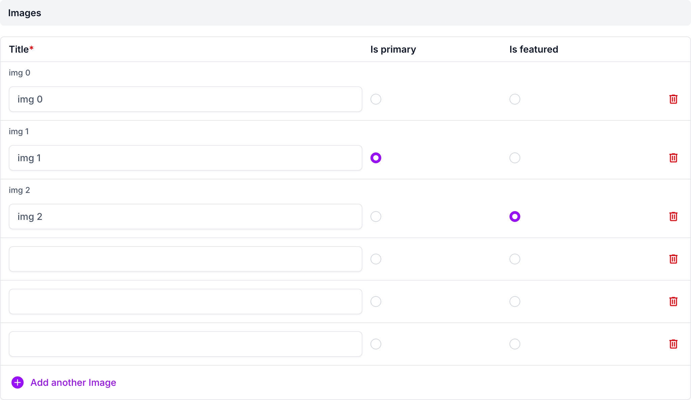
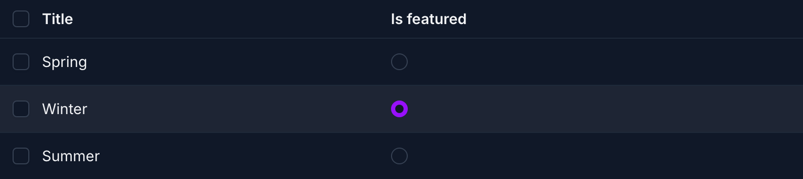

# django-admin-radio-select with django-unfold

## Usage

Works with [django-unfold](https://unfoldadmin.com/) as it is, on its
`ModelAdmin`, `TabularInline` and `StackedInline`: when `unfold` is in
`INSTALLED_APPS`, the radios get Unfold's own radio classes, so they look
like its other radios (light and dark). Tested with django-unfold 0.108.

```python
from unfold.admin import TabularInline


class ImageInline(ExclusiveRadioFieldsMixin, TabularInline):
    model = Image
    radio_select_exclusive_fields = ("is_primary",)
```

## Screenshots

An inline with two exclusive columns:



A `list_editable` column on the changelist, in dark mode:



## Demo

```bash
cd example
DJANGO_SETTINGS_MODULE=example.settings_unfold python manage.py runserver
```
